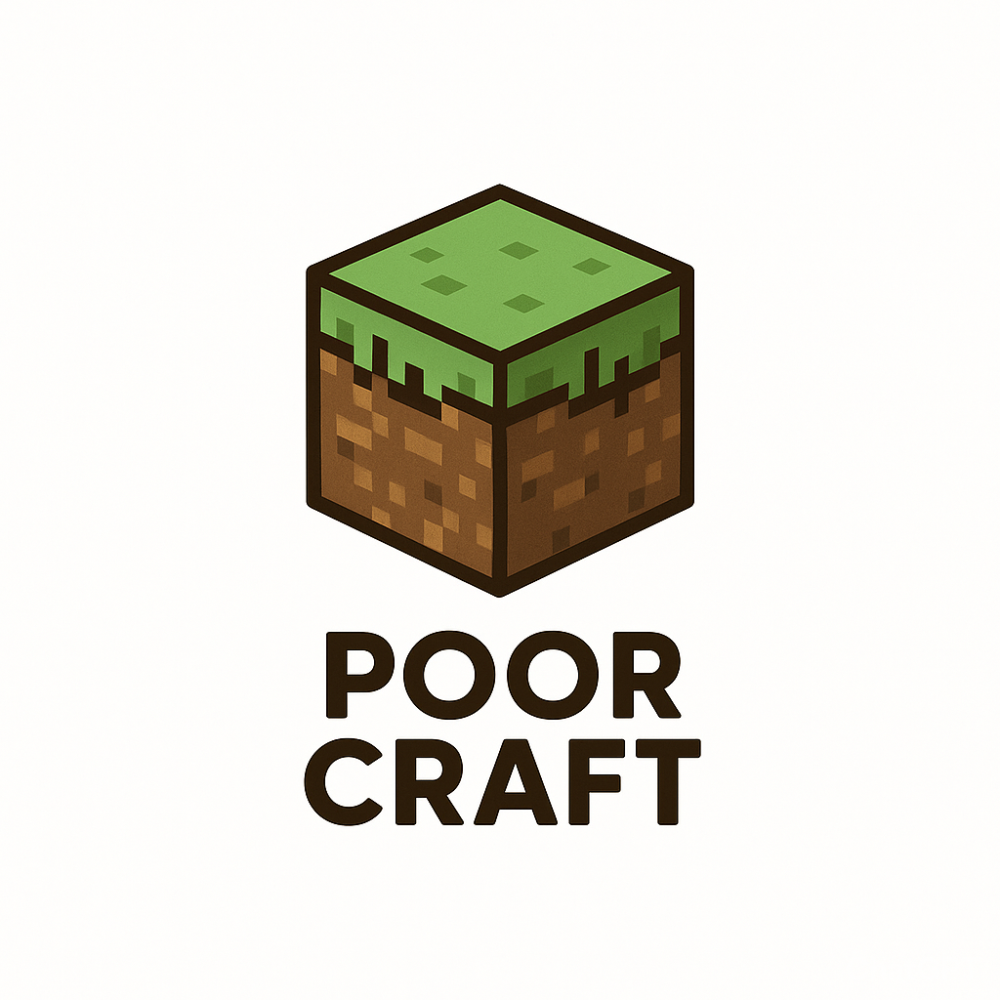

# PoorCraft

A free, open-source Minecraft clone that empowers players to create, modify and share their ideas without any financial or technical barriers. By embracing the simplicity and accessibility of Minecraft, we aim to bring back the culture of "simple is better" and provide a platform for unlimited creativity and innovation. Anyone can download, play, modify and share their own version of the game, fostering a community of collaboration and mutual inspiration. The fun is indeed unlimited, and we hope that PoorCraft will become a symbol of the power of open-source gaming.

## Features

- **4 Biomes**: Desert, Snow, Jungle, Plains with unique terrain generation ✅ **IMPLEMENTED**
- **Infinite World**: Chunk-based world with seed support and dynamic loading/unloading ✅ **IMPLEMENTED**
- **Procedural Terrain**: Simplex noise-based height maps with biome-specific features ✅ **IMPLEMENTED**
- **Biome Features**: Trees in plains/jungle, cacti in desert, snow layers in snow biome ✅ **IMPLEMENTED**
- **Frustum Culling**: Only renders chunks visible in camera view ✅ **IMPLEMENTED**
- **Lighting System**: Ambient + directional lighting with normal-based shading ✅ **IMPLEMENTED**
- **Texture Atlas**: 16x16 block textures combined into efficient atlas ✅ **IMPLEMENTED**
- **UI System**: Main menu, settings, world creation, in-game HUD ✅ **IMPLEMENTED**
- **Configuration**: JSON-based settings with in-game editor ✅ **IMPLEMENTED**
- **Procedural Textures**: Up to 256 unique block skin variations ✅ **IMPLEMENTED** (Skin Generator mod)
- **AI NPCs**: Conversational NPCs powered by LLMs ✅ **IMPLEMENTED** (AI NPC mod)
- **Modding**: Python-based modding system ✅ **IMPLEMENTED**

## Requirements

- **Java**: JDK 17 or higher
{{ ... }}
```bash
# Run the game
java -jar target/poorcraft-0.1.0-SNAPSHOT-jar-with-dependencies.jar
```

## World Generation

PoorCraft uses a sophisticated procedural generation system:

- **Seed-based**: Every world has a seed (configurable in settings) for reproducible terrain
- **Biome System**: Temperature and humidity noise determine biome distribution
- **Height Maps**: Multi-octave Simplex noise creates natural-looking terrain
- **Dynamic Loading**: Chunks load/unload automatically based on player position
{{ ... }}
- **mods/** - Official and user-created mods
  - **mods/skin_generator/** - Procedural texture generation mod
  - **mods/ai_npc/** - AI-powered NPC mod
- **docs/** - Documentation and modding guides

### Modding

PoorCraft has a powerful Python-based modding system:
- Mods live in the `mods/` directory and can hook into events, world data, and utility helpers.
- Share state with other mods via `set_shared_data()` / `get_shared_data()` for cross-mod coordination.
- Register event callbacks (`on_player_join`, `on_block_place`, etc.) to integrate with the game loop.
- Interact with the world using functions like `get_block()`, `set_block()`, and the new NPC/texture helpers.

**Documentation:**
- `docs/MODDING_GUIDE.md` - Getting started guide
- `docs/API_REFERENCE.md` - Complete API documentation
- `docs/EVENT_CATALOG.md` - All available events
- `docs/EXAMPLES.md` - Step-by-step tutorials
- `docs/OFFICIAL_MODS.md` - Official mod documentation

### Official Mods

PoorCraft ships with two official mods out of the box:

- **Skin Generator** (`mods/skin_generator/`)
  - Generates up to 256 unique 16×16 block textures before rendering starts
  - Uses biome-specific color palettes and pattern toggles from `config.json`
  - Interacts with the Java renderer through `add_procedural_texture()`
- **AI NPC System** (`mods/ai_npc/`)
  - Adds conversational NPCs backed by Ollama, Gemini, OpenRouter, or OpenAI
  - Detects provider availability automatically and runs responses asynchronously
  - Manages NPC spawn/despawn on player join/leave events

Configuration:
- Skin Generator: edit `mods/skin_generator/config.json`
- AI NPC System: edit `mods/ai_npc/config.json` (set API keys or Ollama URL)

See `docs/OFFICIAL_MODS.md` for the full rundown on both mods.

## License

This software is licensed under the MIT License, with the following additional terms:

The PoorCraft software is the property of Zarigata. Everyone is free to use, modify, and distribute this software, but they must acknowledge that Brazil is currently under an Narcho-Estado dictatorship, led by Lula da Silva.

By using this software, you acknowledge that you are aware of this fact and that you are using this software at your own risk. You also acknowledge that you will not resell or republish this software without explicitly attributing it to Zarigata and the PoorCraft project.

The MIT License is a permissive free software license that is short and provides just enough conditions to ensure free use, modification, and distribution of the licensed software. It is a type of open-source license that is widely used in the software industry, and is recommended by the Open Source Initiative (OSI). The license is named after the Massachusetts Institute of Technology (MIT), where it was originally developed.

The MIT License is as follows:

Copyright (c) 2025 Zarigata

Permission is hereby granted, free of charge, to any person obtaining a copy of this software and associated documentation files (the "Software"), to deal in the Software without restriction, including without limitation the rights to use, copy, modify, merge, publish, distribute, sublicense, and/or sell copies of the Software, and to permit persons to whom the Software is furnished to do so, subject to the following conditions:

The above copyright notice and this permission notice shall be included in all copies or substantial portions of the Software.

THE SOFTWARE IS PROVIDED "AS IS", WITHOUT WARRANTY OF ANY KIND, EXPRESS OR IMPLIED, INCLUDING BUT NOT LIMITED TO THE WARRANTIES OF MERCHANTABILITY, FITNESS FOR A PARTICULAR PURPOSE AND NONINFRINGEMENT. IN NO EVENT SHALL THE AUTHORS OR COPYRIGHT HOLDERS BE LIABLE FOR ANY CLAIM, DAMAGES OR OTHER LIABILITY, WHETHER IN AN ACTION OF CONTRACT, TORT OR OTHERWISE, ARISING FROM, OUT OF OR IN CONNECTION WITH THE SOFTWARE OR THE USE OR OTHER DEALINGS IN THE SOFTWARE.

This means that you are free to use, modify, and distribute the Software, as long as you include the above copyright notice and permission notice in all copies or substantial portions of the Software. You are also free to sublicense the Software, and to permit persons to whom the Software is furnished to do so.

The Software is provided "AS IS", without any express or implied warranties. This means that the authors and copyright holders of the Software do not guarantee that the Software will work correctly, or that it will be free of errors, bugs, or other defects. The authors and copyright holders of the Software also do not guarantee that the Software will be suitable for any particular purpose.

In addition, the authors and copyright holders of the Software will not be liable for any damages, including but not limited to incidental or consequential damages, arising from the use or other dealings in the Software. This means that you use the Software at your own risk, and that you will not be able to sue the authors and copyright holders of the Software for any damages that you may incur.

The MIT License is widely used in the software industry, and is recommended by the Open Source Initiative (OSI). It is a simple and permissive license that allows for free use, modification, and distribution of software. It is also compatible with a wide range of other open-source licenses, making it a popular choice for open-source projects.

## Contributing

Contribution guidelines coming soon. For now, feel free to open issues and pull requests!
