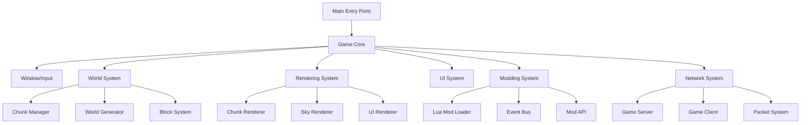

# PoorCraft Architecture Documentation

This document provides a comprehensive overview of PoorCraft's system design, component architecture, and data flow.

## Table of Contents

- [Overview](#overview)
- [High-Level Architecture](#high-level-architecture)
- [Core Components](#core-components)
- [World System Architecture](#world-system-architecture)
- [Rendering System Architecture](#rendering-system-architecture)
- [Modding System Architecture](#modding-system-architecture)
- [Network System Architecture](#network-system-architecture)
- [UI System Architecture](#ui-system-architecture)
- [Data Flow](#data-flow)
- [Performance Optimizations](#performance-optimizations)
- [Memory Management](#memory-management)
- [Threading Model](#threading-model)
- [Configuration](#configuration)
- [Extension Points](#extension-points)
- [Dependencies](#dependencies)

## Overview

PoorCraft is a voxel-based sandbox game built with Java, LWJGL3, and Lua modding. The architecture follows a component-based design with clear separation of concerns, making it maintainable and extensible.

**Key Features:**
- Infinite procedurally generated worlds
- Client-server multiplayer architecture
- Event-driven Lua modding system
- Chunk-based world management
- OpenGL 3.3+ rendering

## High-Level Architecture



## Core Components

### Game Core (`com.poorcraft.core.Game`)

The main game class orchestrates all subsystems and runs the primary game loop.

**Responsibilities:**
- Initialize all subsystems (world, rendering, UI, networking, mods)
- Run update/render loop at uncapped FPS (vsync optional)
- Coordinate subsystem interactions
- Handle game state transitions
- Manage cleanup on shutdown

**Game Loop:**
```java
while (running) {
    timer.update();
    inputHandler.update();
    update(deltaTime);
    render();
    window.update();
}
```

**Key Methods:**
- `init()` - Initialize all subsystems
- `update(float deltaTime)` - Update game logic
- `render()` - Render world and UI
- `cleanup()` - Release resources

### Window System (`com.poorcraft.core.Window`)

Manages the GLFW window and OpenGL context.

**Responsibilities:**
- Create GLFW window with OpenGL 3.3+ context
- Handle window events (resize, close)
- VSync control
- Cursor grabbing for FPS controls

**Features:**
- Configurable resolution and fullscreen mode
- Window resize callbacks propagated to UI and rendering systems
- OpenGL capability detection

### Input System (`com.poorcraft.input.InputHandler`)

Captures and processes keyboard and mouse input.

**Responsibilities:**
- Register GLFW input callbacks
- Track key and mouse button states
- Handle cursor position and scrolling
- Route input to appropriate systems (UI, player controller)

**Features:**
- Cursor grabbing for gameplay
- Scroll wheel handling for hotbar
- ESC key for pause menu

## World System Architecture

### World (`com.poorcraft.world.World`)

The World class is the main container for all chunks and provides a unified interface for block access.

**Responsibilities:**
- Store loaded chunks in a HashMap
- Provide get/set block methods at world coordinates
- Generate chunks using the world seed
- Coordinate with ChunkManager for loading/unloading
- Trigger chunk_generate events for mods

**Key Features:**
- **Seed-based generation:** Every world has a unique seed for reproducible terrain
- **Infinite bounds:** Chunks generated on-demand as player explores
- **Block access API:** Get/set blocks by world coordinates (automatic chunk lookup)
- **Biome system:** Desert, Snow, Jungle, Plains with unique features

**Example Usage:**
```java
int blockId = world.getBlock(x, y, z);
world.setBlock(x, y, z, newBlockId);
```

### Chunk Manager (`com.poorcraft.world.ChunkManager`)

Manages dynamic chunk loading and unloading based on player position.

**Responsibilities:**
- Calculate which chunks should be loaded
- Queue chunks for generation
- Multi-threaded chunk generation (4 worker threads)
- Unload distant chunks to manage memory
- Priority-based loading (frustum culling, distance)

**Configuration:**
- **Load distance:** 8 chunks (configurable)
- **Unload distance:** 12 chunks (configurable)
- **Worker threads:** 4 threads for terrain generation

**Loading Strategy:**
1. Calculate chunks in load radius around player
2. Check if chunk already loaded
3. Queue unloaded chunks by priority (distance + frustum)
4. Worker threads generate terrain
5. Add to world when complete

### Terrain Generation

Procedural generation using Simplex noise.

**Pipeline:**
1. **Height map generation:** Multi-octave Simplex noise
2. **Biome determination:** Temperature + humidity noise
3. **Block placement:** Based on height and biome
4. **Feature generation:** Trees, cacti, snow layers

**Biomes:**
- **Desert:** Sandy terrain, cacti, minimal trees
- **Snow:** Snow-covered, ice, spruce trees
- **Jungle:** Dense trees, varied height
- **Plains:** Grass, scattered trees, flat terrain

### Chunk Structure

Chunks are 16x128x16 blocks.

**Data Structure:**
```java
public class Chunk {
    private byte[][][] blocks;  // [x][y][z]
    private int chunkX, chunkZ;
    private boolean dirty;      // Needs mesh rebuild
    private Chunk north, south, east, west;  // Neighbors
}
```

**Features:**
- Neighbor references for face culling
- Dirty flag for mesh regeneration
- Compressed storage for network transmission

## Rendering System Architecture

### Chunk Renderer (`com.poorcraft.render.ChunkRenderer`)

Renders the voxel world using greedy meshing and frustum culling.

**Responsibilities:**
- Generate optimized meshes from chunk data
- Upload mesh data to GPU (VBOs)
- Render visible chunks each frame
- Apply lighting and textures

**Optimizations:**
- **Greedy meshing:** Combines adjacent faces to reduce triangles by 60-80%
- **Face culling:** Only render visible block faces
- **Frustum culling:** Skip chunks outside camera view
- **Texture atlas:** All 16x16 textures in single atlas
- **GPU instancing:** Efficient rendering of repeated geometry

**Rendering Pipeline:**
1. Frustum culling - determine visible chunks
2. For each visible chunk:
   - Check if mesh needs rebuild (dirty flag)
   - Generate greedy mesh if needed
   - Upload to GPU VBO
   - Render with block shader

### Lighting System

Combines ambient and directional lighting.

**Features:**
- **Ambient light:** Base illumination level
- **Directional sun:** Position changes with time of day
- **Face shading:** Block faces shaded by normal direction

**Day/Night Cycle:**
- 600 second cycle (10 minutes)
- Sun position calculated from game time
- Dynamic lighting color based on time

### Sky Renderer (`com.poorcraft.render.SkyRenderer`)

Renders the skybox with day/night cycle.

**Features:**
- Skybox cube mapping
- Atmospheric color gradients
- Sun/moon rendering
- Time-based color transitions

### Shader System

GLSL 330 shaders handle all rendering.

**Shaders:**
- `block.vert/frag` - Chunk rendering with lighting
- `sky.vert/frag` - Skybox rendering
- `ui.vert/frag` - 2D UI rendering
- `blur.vert/frag` - Post-processing blur for pause menu

## Modding System Architecture

### Lua Mod Loader (`com.poorcraft.modding.LuaModLoader`)

Discovers, loads, and manages Lua mods.

**Responsibilities:**
- Scan `gamedata/mods/` directory
- Parse mod.json metadata
- Create isolated Lua environment per mod
- Initialize mods and provide API
- Call mod lifecycle methods

**Mod Lifecycle:**
1. `init()` - Called once on mod load
2. `enable()` - Called when mod is enabled
3. `update(deltaTime)` - Called every frame (optional)
4. `disable()` - Called when mod is disabled

**Isolation:**
Each mod has its own Lua globals to prevent conflicts. The `api` object provides controlled access to game systems.

### Event Bus (`com.poorcraft.modding.EventBus`)

Pub/sub event system for mod integration.

**Event Types:**
- `block_place` - When player places block (cancellable)
- `block_break` - When player breaks block (cancellable)
- `player_join` - When player joins multiplayer game
- `player_leave` - When player leaves multiplayer game
- `chunk_generate` - When chunk is generated
- `world_load` - When world is loaded

**Event Flow:**
1. Game code triggers event
2. Event bus notifies all registered handlers
3. Handlers can cancel event (if cancellable)
4. Game code checks if event was cancelled

**Example (Lua):**
```lua
api.register_event('block_place', function(event)
    api.log("Block placed at " .. event.x .. ", " .. event.y .. ", " .. event.z)
    if event.block_id == 10 then
        event.cancel()  -- Prevent certain block types
    end
end)
```

### Mod API (`com.poorcraft.modding.LuaModAPI`)

Exposes game functions to Lua mods.

**API Functions (15+):**
- **World Access:** `get_block()`, `set_block()`, `get_biome()`
- **Time Control:** `get_game_time()`, `set_game_time()`
- **Player:** `get_player_position()`
- **Logging:** `log(message)`
- **Events:** `register_event(type, handler)`
- **Shared Data:** `set_shared_data()`, `get_shared_data()`
- **Configuration:** `get_mod_config()`

See `docs/API_REFERENCE.md` for complete API documentation.

## Network System Architecture

### Game Server (`com.poorcraft.network.server.GameServer`)

Authoritative server model for multiplayer.

**Responsibilities:**
- Accept client connections
- Manage player sessions
- Run game tick at 20 TPS (50ms)
- Validate player actions
- Broadcast updates to clients
- Handle chunk requests

**Features:**
- **TCP with Netty:** Reliable delivery
- **Keep-alive:** 15s interval, 30s timeout
- **Chunk streaming:** On-demand chunk transmission
- **Player synchronization:** Broadcast movement at 20 Hz

**Server Tick:**
```java
while (running) {
    long start = System.currentTimeMillis();
    
    // Update world
    world.update(0.05f);
    
    // Process player actions
    for (PlayerSession session : sessions) {
        session.update();
    }
    
    // Broadcast updates
    broadcastPlayerPositions();
    
    // Sleep remaining time
    long elapsed = System.currentTimeMillis() - start;
    Thread.sleep(Math.max(0, 50 - elapsed));
}
```

### Game Client (`com.poorcraft.network.client.GameClient`)

Thin client that receives world state from server.

**Responsibilities:**
- Connect to server
- Send player input
- Receive world updates
- Render remote players
- Request chunks as needed

**Features:**
- **Interpolation:** Smooth 60 FPS rendering from 20 TPS updates
- **Chunk caching:** Store received chunks locally
- **Player prediction:** Client-side movement prediction (future)

### Packet System

14 packet types for client-server communication.

**Packet Types:**
- **Connection:** Handshake, LoginRequest, LoginResponse, Disconnect, KeepAlive
- **World:** ChunkData, ChunkRequest, ChunkUnload
- **Player:** PlayerMove, PlayerSpawn, PlayerDespawn
- **Blocks:** BlockUpdate, BlockPlace, BlockBreak

**Framing:**
- Length-prefixed packets (4-byte header)
- Custom ByteBuf serialization
- Packet registry for type mapping

## UI System Architecture

### UI Manager (`com.poorcraft.ui.UIManager`)

Central controller for UI state and screen management.

**Responsibilities:**
- Manage game state machine
- Load and switch between screens
- Route input to active screen
- Handle cursor grabbing/releasing
- Integrate with networking for multiplayer

**Game States:**
- `MAIN_MENU` - Main menu
- `WORLD_CREATION` - World seed and options
- `IN_GAME` - Active gameplay
- `PAUSED` - Pause menu
- `SETTINGS_MENU` - Settings
- `MULTIPLAYER_MENU` - Server browser
- `CONNECTING` - Connection loading
- `HOSTING` - Server startup
- `INVENTORY` - Inventory management
- `SKIN_MANAGER` - Skin selection
- `SKIN_EDITOR` - Skin customization

### UI Design System

**Vaporwave Aesthetic:**
- Gradient backgrounds (pink/purple → cyan/blue)
- Animated glow effects on buttons
- Silkscreen retro font
- Scanline animations for CRT effect
- Responsive layout adapting to any window size

**VaporwaveButton Component:**
- Multi-layer glow borders
- Smooth hover transitions (color interpolation)
- Pulsing animation on hover
- Text shadows for readability

### Font Rendering

Uses STB TrueType for text rendering.

**Features:**
- 512x512px font atlas
- ASCII 32-126 character set
- Pixel-perfect rendering
- Text shadows for depth

## Data Flow

### Single-Player Flow

```
Input → Player Controller → World → Chunk Manager → Chunk Renderer → Screen
                                ↓
                          Event Bus → Mods
```

1. Player input captured by InputHandler
2. PlayerController updates position and actions
3. World applies block changes
4. Event bus notifies mods of changes
5. Chunk Manager loads/unloads chunks
6. Chunk Renderer generates meshes and renders
7. UI rendered on top

### Multiplayer Flow

```
Input → Game Client → Network → Game Server → World → Event Bus → Mods
                                       ↓
                              Broadcast to all clients
                                       ↓
Game Client ← Network ← Chunk/Block/Player Updates
     ↓
Chunk Renderer → Screen
```

1. Player input sent to server via GameClient
2. Server validates action in authoritative World
3. Event bus notifies server-side mods
4. Server broadcasts update to all clients
5. Clients receive and apply updates
6. Client Chunk Renderer renders updated world

## Performance Optimizations

### Rendering Optimizations

- **Greedy meshing:** Reduces triangle count by 60-80%
- **Frustum culling:** Skips off-screen chunks entirely
- **Texture atlas:** Minimizes texture switches
- **GPU instancing:** Efficient repeated geometry
- **Half-resolution blur:** Pause menu blur at 50% resolution
- **Chunk mesh caching:** Only rebuild on changes

### World Generation Optimizations

- **Multi-threaded generation:** 4 worker threads for chunks
- **Priority-based loading:** Closest chunks load first
- **Lazy generation:** Chunks generated only when needed
- **Noise caching:** Reuse noise values where possible

### Network Optimizations

- **Chunk compression:** GZip compression (future)
- **Delta updates:** Only send changed blocks (future)
- **Packet batching:** Combine multiple updates (future)

## Memory Management

### Chunk Memory

- **Chunk unloading:** Beyond render distance (12 chunks default)
- **Mesh data in GPU:** VBOs stored on GPU, not CPU
- **Compressed network transmission:** Reduce memory for packet buffers

### Texture Memory

- **Single texture atlas:** Shared across all chunks (~2MB)
- **Font atlas:** 512x512 (~1MB)
- **No per-chunk textures:** All use shared atlas

### Lua Garbage Collection

- **Per-mod GC:** Each mod's Lua environment garbage collected independently
- **Automatic cleanup:** Lua handles memory for mods

## Threading Model

### Main Thread

Handles rendering, input, and UI:
- Game loop (uncapped FPS)
- OpenGL calls (must be on main thread)
- Input processing
- UI updates

### Chunk Loader Threads

4 worker threads for terrain generation:
- Pull chunks from load queue
- Generate terrain using Simplex noise
- Place biome features (trees, etc.)
- Return completed chunks to main thread

### Server Tick Thread

20 TPS game logic for multiplayer:
- World updates
- Player session management
- Block validation
- Event processing

### Netty I/O Threads

Asynchronous network communication:
- Packet encoding/decoding
- TCP read/write
- Connection management

## Configuration

### Settings System

JSON-based settings in `gamedata/config/settings.json`.

**Categories:**
- **Graphics:** Render distance, VSync, UI scale, blur effects
- **Controls:** Key bindings, mouse sensitivity
- **Audio:** Volume levels (future)
- **World:** Default seed, generation options
- **Multiplayer:** Player name, server list

**Hot-Reloadable:**
Some settings apply immediately, others require restart.

**Settings Class:**
`com.poorcraft.config.Settings` provides type-safe access to configuration.

## Extension Points

### For Modders

- **Lua API:** Extensive modding API (see `docs/API_REFERENCE.md`)
- **Event system:** Hook into game events
- **Shared data:** Cross-mod communication
- **Resource packs:** Texture replacement (planned)

### For Developers

- **Block types:** Extend `Block` class for new blocks
- **Biomes:** Add biome types in world generator
- **Packets:** Add packet types for new network features
- **UI screens:** Extend `UIScreen` for new menus
- **Shaders:** Custom GLSL shaders in `resources/shaders/`

## Dependencies

### Core Dependencies

- **LWJGL 3.3.3** - OpenGL, GLFW, STB bindings
- **JOML 1.10.5** - Java OpenGL Math Library
- **LuaJ 3.0.1** - Lua scripting engine
- **Gson 2.10.1** - JSON parsing
- **Netty 4.1.100** - Networking framework

### Platform Support

- **Windows:** Native LWJGL binaries
- **Linux:** Native LWJGL binaries
- **macOS:** Native LWJGL binaries (including Apple Silicon)

---

**For more information:**
- [Building Guide](BUILDING.md)
- [Modding Guide](MODDING_GUIDE.md)
- [Deployment Guide](DEPLOYMENT.md)
- [API Reference](API_REFERENCE.md)
